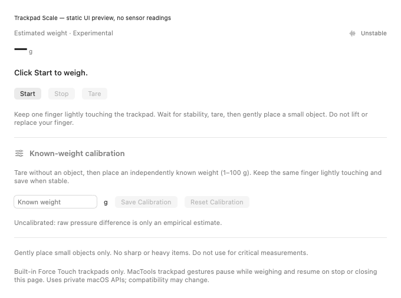
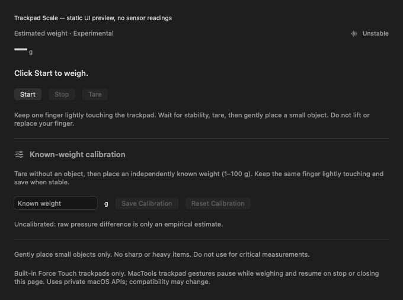
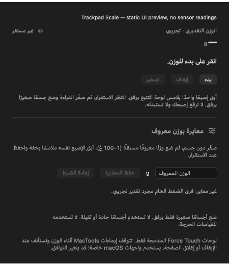

# Trackpad Scale (experimental)

Trackpad Scale is an optional plugin for estimating small object weights on a **built-in Force Touch trackpad**. It requires MacTools 2.0.2. Capability checks require the private runtime to report both built-in status and force support; model age is never used. Missing optional capability symbols fail closed. External Magic Trackpads are not supported or advertised.

## Try it

1. Run `make run` from a configured checkout to build and sync the Debug plugin catalog. In MacTools, install/enable **Trackpad Scale / 触控板称重** from the local development catalog if it is not already installed.
2. Open its settings page, or click **Open / 打开** on its panel row. Click **Start / 开始**.
3. Keep one finger lightly touching the trackpad with no object on it. Wait for **Stable / 稳定**, then click **Tare / 归零**. Prefer a mouse or keyboard for the buttons so pressing them does not change finger pressure.
4. Gently place a small, smooth object while keeping the same finger in the same position with steady pressure. Read the approximate whole-gram estimate once stable.
5. For calibration, tare without an object, place an independently known small weight of **1–100 g**, wait for stability, enter its weight, and click **Save Calibration / 保存校准**. Calibration is empirical and does not guarantee accuracy.
6. Click **Stop / 停止** when finished. Leaving or closing the settings page also stops weighing. Remove all fingers before trying gestures again.

Use only small objects and gentle placement. Never use sharp or heavy items, or rely on this tool for critical measurements. A changing finger position or pressure can change the estimate substantially.

## UI preview

The settings measurement section uses native controls in light and dark appearances. These static previews contain no sensor readings; physical interaction and accuracy validation remain pending. The entry point is the plugin's settings page or its panel's Open action.







## Measurement and recovery

The pressure-minus-tare baseline follows the empirical approach described by [TrackWeight's ScaleViewModel](https://github.com/KrishKrosh/TrackWeight/blob/main/TrackWeight/ScaleViewModel.swift). This plugin is independently implemented; no TrackWeight source was copied. Apple does not specify that the raw field is measured in grams or guarantee an accuracy. There is no `NSEvent.pressure` fallback and no synthetic-reading mode in the app.

The filter uses a modest time-based exponential average. Stability checks a short window of **unsmoothed** pressure so smoothing cannot conceal motion. The initial smoothing and stability thresholds are provisional until hardware comparisons establish whether they are useful. Whole-gram display is a presentation choice, not a claim of one-gram accuracy.

Tare is temporary. Finger loss, replacement, extra contacts, invalid samples, long gaps, device changes, sleep/lock, shutdown, and closing the page clear transient measurements. A stopped or interrupted session must be explicitly started and tared again. Calibration factors are stored separately per stable native device ID in plugin-scoped storage; without a persistent device identity, calibration is session-only. Reset Calibration removes the current device's saved factor. Raw touch histories are neither logged nor saved; the bounded stability window exists only in memory.

The host owns one subscription-based MultitouchSupport driver and its existing process lease. Trackpad Gestures and Middle Click use this shared input. Weighing pauses their actions and event taps without altering saved preferences. They resume after stopping, and gesture input waits for each device's zero-contact boundary so a weighing touch cannot become a gesture.

This feature needs no new permission or entitlement: it reads the same private contact stream, without posting input events. Gesture plugins retain their own existing permissions. There are no signing or security-setting changes.

## Private API compatibility

The host dynamically loads `/System/Library/PrivateFrameworks/MultitouchSupport.framework/MultitouchSupport`, preserving the existing `MTTouch` C layout and callback/unregister ownership. It copies contacts, including pressure, before the callback returns. `MTDeviceIsBuiltIn`, `MTDeviceSupportsForce`, and identity/service lookups are optional, checked symbols. Missing required listening symbols disable listening. macOS updates can change this undocumented interface or its pressure behavior.

The host invalidates callback generations on stop/restart, observes device arrival/removal with IOKit and debounce, interrupts on host activity transitions, and stops native listening after the last subscriber leaves. A stalled contact stream clears weighing rather than displaying an old weight. The existing process lease policy prevents a secondary development/test host from taking an installed app's listener.

## Verification in this checkout

| Check | Result |
| --- | --- |
| Focused XCTest: scale-model calibration, persistence, stale/coalesced frames, and locale-specific numeric input | Passed: four tests, zero failures |
| `make ci`: full XCTest, script checks, and frozen PluginKit v7 binary client | Passed: 2,727 XCTest tests passed, four skipped, zero failures; 229 script checks passed |
| `make script-tests` (includes changelog, generated plugin data, localization, and minimum-host inventory) | Passed: 229 checks |
| Frozen PluginKit v7 binary client against the built framework | Passed |
| Unsigned Debug host and plugin build using the repository Xcode wrapper | Passed |
| `make build` | Blocked by missing `LocalConfig.xcconfig`; no signing configuration was created or changed |
| Static native UI snapshots: English/Chinese, light/dark, German/Turkish narrow content, and Arabic right-to-left layout | Passed: no clipping in inspected layouts; no sensor readings supplied |
| Real sensor and accuracy validation | Untested: available Mac mini enumerated zero multitouch devices |

Focused model test command: `make test TEST_FILTER=TrackpadScaleModelTests`.

To run the broader feature tests:

```bash
make test TEST_FILTER='TrackpadScaleMeasurementTests TrackpadScaleModelTests SharedTrackpadInputServiceTests TrackpadGesturesPluginTests TrackpadGestureRecognizerTests TrackpadMiddleClickArbiterTests TrackpadMiddleClickCoordinatorTests MiddleClickPluginTests TrackpadTypingSuppressionGateTests'
```

The unsigned build used `scripts/xcodebuild-filtered.sh` with the existing Debug scheme and `CODE_SIGNING_ALLOWED=NO`, `CODE_SIGNING_REQUIRED=NO`, and an empty `CODE_SIGN_IDENTITY` command-line override. No project signing or security settings were changed. No checks are marked as hardware passes from synthetic fixtures.

## Manual hardware checklist

Current hardware evidence: a read-only probe on the available Mac mini enumerated **zero multitouch devices**, so physical sensor and accuracy checks are **untested**. Static light/dark UI snapshots are checked separately; interactive desktop checks below remain untested. Automated tests use explicitly synthetic fixtures only. Record Mac model, macOS version, native device ID/capabilities, plugin version, known weights, estimates, and pass/fail observations locally; do not record raw touch histories.

| Check | Expected outcome | Status |
| --- | --- | --- |
| Capability and real sensor path | Built-in Force Touch identified; finite positive raw pressure changes with gentle force, before tuning/calibration | Untested |
| Unsupported/non-force device | Clear unsupported state; no estimate or gesture pause remains | Untested |
| Known-weight comparisons | Compare several independently measured small weights before and after calibration; repeat placements and record error/range without promising accuracy | Untested |
| Finger lift and replacement | Estimate disappears immediately; replacement requires a new tare | Untested |
| Extra contact | Multiple-contact state; no estimate; return to one finger requires tare | Untested |
| Repeated tare | Tare repeatedly with no object, then compare the same known weight | Untested |
| Close/reopen and repeated Start/Stop | Listener releases if unused; reopened page is stopped with no stale tare/weight | Untested |
| Sleep/wake, screen lock, device re-enumeration | Session interrupts, weight clears, gestures recover; weighing requires explicit restart/tare | Untested |
| Gestures enabled | Configured Trackpad Gestures actions and Middle Click pause during weighing, resume after stop/close and finger lift; saved preferences unchanged | Untested |
| Gestures disabled | Weighing still receives pressure; stopping releases the only listener | Untested |
| UI/accessibility | Check supported languages including Arabic right-to-left layout, light/dark, narrow settings window, keyboard/focus, VoiceOver, and disabled controls | Untested |

Mark a check **Passed** only after observing its expected outcome. Record **Failed** with reproduction details when it differs, and keep unavailable hardware/physical actions **Untested**.
