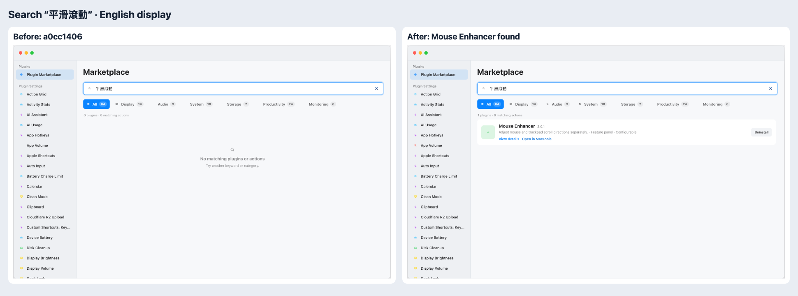
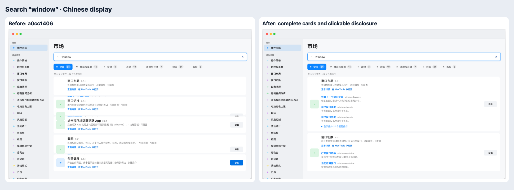

# Twelve-locale discovery and search layout audit

This follow-up starts from `a0cc1406997135edf79804fd87d862e50cda1e22`. The complete [query matrix and source provenance](localized-search-audit.json) records every selected capability label, its owning plugin, its 12 translated queries, and before/after membership. All 64 plugins were audited; 47 manifests gain 156 capability labels. Of these, 119 reuse current translations (108 through owning-catalog references and 11 copied from existing catalogs), and 37 use complete discovery-specific locale tables. Those tables include five corrected native-label tables; their 12 incorrect or incomplete values are replaced while their other values are retained. Existing literal terms are preserved.

The 12 locales describe searchable metadata. Website presentation supports English and simplified Chinese. Search has one index across locales; changing its display language preserves owners/actions, counts, query, category filter and expansion. Labels and alphabetical ordering can change, including which tied actions appear first. NFC normalization handles canonically equivalent Unicode. The same normalization applies to queries and indexed text: Turkish `I`, `İ`, `ı`, and `i` share one search form, and German `ß`, `ẞ`, and `SS` share `ss`. This supports sentence and mixed casing without enumerating whole-field variants. The native marketplace matcher uses the same rules for its queries and existing search fields. This matching stays independent of the display language and does not translate queries, strip ordinary accents or convert Chinese scripts.

## Before and after

The production matcher finds 318 of 1,872 selected capability queries at baseline, and all 1,872 after this change. It finds 1,075 of 1,536 declared translated plugin name/summary queries at baseline, and all 1,536 after indexing every declared locale. The previous 284 accepted owner/query pairs continue to pass. These checks establish the listed declared queries, rather than every possible synonym or semantic query.

| Locale | Capability before | Capability after | Name/summary before | Name/summary after |
| --- | ---: | ---: | ---: | ---: |
| ar | 9 / 156 | 156 / 156 | 81 / 128 | 128 / 128 |
| de | 8 / 156 | 156 / 156 | 82 / 128 | 128 / 128 |
| en | 114 / 156 | 156 / 156 | 128 / 128 | 128 / 128 |
| es | 8 / 156 | 156 / 156 | 82 / 128 | 128 / 128 |
| fr | 8 / 156 | 156 / 156 | 82 / 128 | 128 / 128 |
| ja | 13 / 156 | 156 / 156 | 82 / 128 | 128 / 128 |
| ko | 11 / 156 | 156 / 156 | 82 / 128 | 128 / 128 |
| pt | 7 / 156 | 156 / 156 | 82 / 128 | 128 / 128 |
| ru | 5 / 156 | 156 / 156 | 82 / 128 | 128 / 128 |
| tr | 11 / 156 | 156 / 156 | 83 / 128 | 128 / 128 |
| zh-Hans | 111 / 156 | 156 / 156 | 128 / 128 | 128 / 128 |
| zh-Hant | 13 / 156 | 156 / 156 | 81 / 128 | 128 / 128 |

`平滑滾動`, `Sanftes Scrollen`, `Défilement fluide`, and `スムーズスクロール` now find Mouse Enhancer in either website language. Trackpad gesture aliases remain discovery metadata, with no invented static action. Global brands and acronyms retain their original spelling.

## Capitalization follow-up

A separate review of `a7d4fe3f28ee135c86b04b63391df2b0ce390872` found three remaining gaps: sentence/mixed Turkish casing on the website, lowercase dotted-I aliases in the native marketplace, and German sharp-S uppercase queries on the website. Whole-field Turkish variants did not cover capitalization of an arbitrary substring; native plain lowercasing retained a combining dot; German uppercasing can expand `ß` to `SS`.

| Surface and query | Before this follow-up | After this follow-up |
| --- | --- | --- |
| Website `Işığı azaltın` | No owners; lowercase `ışığı azaltın` worked | Night Shift |
| Website `Ortam Işığına` | No owners; lowercase `ortam ışığına` worked | True Tone |
| Website `Uygulama Izgarasını` | No owners; lowercase `uygulama ızgarasını` worked | Launchpad and its existing action |
| Website `FENSTERHÖHE VERGRÖSSERN` | No actions; `Fensterhöhe vergrößern` worked | Window Layouts / Increase Height |
| Website `ANGEMESSENE GRÖSSE` | No actions; `Angemessene Größe` worked | Window Layouts / Reasonable Size |
| Native `iç içe klasörler` | Did not match the declared `İç içe klasörler` alias | Action Grid alias matches |
| Native `istem şablonu`, `imleci izle`, `izleme dörtgeni hareketi` | Did not match their dotted-I aliases | AI Assistant, Display Volume, and Input Remapping aliases match |

The before queries were reproduced in Chromium/WebKit and Swift/Foundation. Focused website and native matcher tests cover reciprocal Turkish/German casing, canonical Unicode, retained ordinary accents and existing substring/empty-input boundaries. Browser checks compare owner/action sets, counts and routes for each query pair in both website display languages. The native guarantee concerns matching existing search fields; this change does not alter which active-language prose the native marketplace selects or make every native field available in every language. Metadata and generated action data are unchanged.

## Search row sizing

Searching `window` returns the same 5 plugins and 43 actions before and after. The constrained marketplace grid previously allocated about 101–102 pixels to Window Layouts while its content required 264–274 pixels; later cards covered the disclosure and intercepted clicks. Intrinsic grid row sizing gives the card its full content height and keeps the list scrollable.

The comparison PNGs combine genuine Chromium captures made on 2026-10-10 with the same 1440×1100 viewport, light appearance and reduced motion. The row comparison uses Chinese display and query `window`; the capability comparison uses English display and query `平滑滾動`. Before captures use the built baseline above. After captures represent the source change containing these artifacts. Images are resized and placed side by side with comparison labels; page contents are not edited. Earlier issue 472 captures keep their original provenance.

The terminology pass reviewed all 156 labels across 12 locales, including all 124 initially reused labels. Five reused tables needed discovery-specific corrections: Activity Bar scrolling had been translated as parchment scrolls in seven locales, Japanese screen time as film running time, Arabic/Russian fan RPM as advertising revenue, French speech output as speaking in translation, and Turkish barcode recognition as QR-only recognition. Correct capability queries such as `Défilement`, `スクリーンタイム`, `Целевые обороты`, `Lire la traduction` and `barkod` now match their owners. Representative production checks also reject the new wrong-domain associations. Existing native UI resource files are preserved.

## Authoring and safeguards

`discovery.localizedSynonymRefs` reuses complete `productStrings` entries backed by active native labels or complete authored translations. Projection merges resolved values into ordinary per-locale synonym arrays and strips all source-only references before packaging/catalog/website output. Missing keys/locales and invalid reference shapes fail validation; existing literal aliases remain supported. Projected-package validation also rejects leftover authoring references, including when catalog generation has no source manifest, before writing either catalog or website output.

Only reviewed implemented concepts are selected. Resource existence alone is insufficient: obsolete Translator provider labels, Mouse Enhancer middle-click labels, unsupported trackpad pinch/rotation/swipe/force-click, fan temperature curves, Night Shift schedule/temperature controls and refresh-rate selection remain excluded. System Data aliases refer to supported container/VM storage groups, without promising generic VM inventory or cleanup. The [earlier audit](search-metadata-audit.md) records original exclusions and hardware boundaries.

Native Marketplace receives the expanded multilingual aliases through its existing catalog shape. Its own matcher also uses active-language prose, so the website's language-invariant membership guarantee does not establish an identical native search contract.

## Validation

- Manifest/projector tests: 35 passed, including reference expansion, merge/deduplication, missing-reference/locale rejection, source-only-field removal and source-less catalog rejection without output. The release fixture includes the resource catalog now required by its manifest.
- Repository script suite: 232 passed with system access; generated-data, complete localization and changelog validation passed. Initial sandbox checks exposed Swift module-cache/process-inspection restrictions; the complete permitted run passed. A language-switch browser timeout passed identical diagnostic flows and its single permitted retry; the final flow waits for rendered layout before each pointer toggle.
- Production matcher: 1,872 capability queries, 1,536 translated name/summary queries and all previous 284 owner/query pairs passed. All 3,408 locale-specific lowercase variants also pass across 12 locales; Turkish dotted/dotless-I capitalization is covered in plugin metadata and action title/description checks.
- Native marketplace matching: 3 focused XCTest tests pass for reciprocal Turkish/German casing, canonical Unicode, retained accents and substring/empty-input boundaries. The complete unsigned CI-equivalent suite is required for this follow-up; results are recorded in PR #474.
- Website checks: 6 focused tests and all 14 site tests passed; build produced 203 pages with zero errors, warnings or hints.
- Chromium/WebKit: 104 localized query checks and 12 layout flows across 1440/760/390 widths and both display languages passed. Actual pointer and keyboard disclosure, overflow-action navigation, card containment, matching/count/state preservation and category filtering passed without page errors.
- Runtime/source envelopes, original product strings and literal aliases remain intact; the 135-action generated projection is byte-identical to baseline. Relevant existing issue 472 browser flows, diff checks and final stable source review are required before publication.
- Validation covers website behavior and metadata projection. It does not run native app actions or hardware acceptance, publish plugin packages, or deploy the website.

## Plugin dispositions

The matrix contains full source keys and translations for each selected label. Owners with zero additions already expose reviewed core concepts through complete localized metadata/static actions or language-neutral terms; they are covered by the all-locale name/summary verification.

| Plugin | Labels added | Disposition |
| --- | ---: | --- |
| [AIAssistant](../../../Plugins/AIAssistant/plugin.json) | 6 | Extended with reviewed localized labels |
| [AIUsage](../../../Plugins/AIUsage/plugin.json) | 2 | Extended with reviewed localized labels |
| [ActionGrid](../../../Plugins/ActionGrid/plugin.json) | 2 | Extended with reviewed localized labels |
| [ActivityBar](../../../Plugins/ActivityBar/plugin.json) | 5 | Extended with reviewed localized labels |
| [AppHotkey](../../../Plugins/AppHotkey/plugin.json) | 1 | Extended with reviewed localized labels |
| [AppVolume](../../../Plugins/AppVolume/plugin.json) | 3 | Extended with reviewed localized labels |
| [Appearance](../../../Plugins/Appearance/plugin.json) | 0 | Covered by existing translated metadata/actions or invariant keywords |
| [AppleShortcuts](../../../Plugins/AppleShortcuts/plugin.json) | 2 | Extended with reviewed localized labels |
| [AutoHideDock](../../../Plugins/AutoHideDock/plugin.json) | 1 | Extended with reviewed localized labels |
| [AutoHideMenuBar](../../../Plugins/AutoHideMenuBar/plugin.json) | 2 | Extended with reviewed localized labels |
| [AutoInput](../../../Plugins/AutoInput/plugin.json) | 2 | Extended with reviewed localized labels |
| [BatteryChargeLimit](../../../Plugins/BatteryChargeLimit/plugin.json) | 0 | Covered by existing translated metadata/actions or invariant keywords |
| [Calendar](../../../Plugins/Calendar/plugin.json) | 2 | Extended with reviewed localized labels |
| [ClipboardClear](../../../Plugins/ClipboardClear/plugin.json) | 0 | Covered by existing translated metadata/actions or invariant keywords |
| [ClipboardHistory](../../../Plugins/ClipboardHistory/plugin.json) | 5 | Extended with reviewed localized labels |
| [CloudflareR2](../../../Plugins/CloudflareR2/plugin.json) | 2 | Extended with reviewed localized labels |
| [DeviceBattery](../../../Plugins/DeviceBattery/plugin.json) | 1 | Extended with reviewed localized labels |
| [DiskClean](../../../Plugins/DiskClean/plugin.json) | 3 | Extended with reviewed localized labels |
| [DisplayBrightness](../../../Plugins/DisplayBrightness/plugin.json) | 1 | Extended with reviewed localized labels |
| [DisplayResolution](../../../Plugins/DisplayResolution/plugin.json) | 0 | Covered by existing translated metadata/actions or invariant keywords |
| [DisplaySleep](../../../Plugins/DisplaySleep/plugin.json) | 1 | Extended with reviewed localized labels |
| [DisplayTrueColor](../../../Plugins/DisplayTrueColor/plugin.json) | 0 | Covered by existing translated metadata/actions or invariant keywords |
| [DisplayVolume](../../../Plugins/DisplayVolume/plugin.json) | 2 | Extended with reviewed localized labels |
| [DockClickMinimize](../../../Plugins/DockClickMinimize/plugin.json) | 0 | Covered by existing translated metadata/actions or invariant keywords |
| [DockLock](../../../Plugins/DockLock/plugin.json) | 0 | Covered by existing translated metadata/actions or invariant keywords |
| [DuoStatus](../../../Plugins/DuoStatus/plugin.json) | 3 | Extended with reviewed localized labels |
| [EjectDisk](../../../Plugins/EjectDisk/plugin.json) | 1 | Extended with reviewed localized labels |
| [EmptyTrash](../../../Plugins/EmptyTrash/plugin.json) | 0 | Covered by existing translated metadata/actions or invariant keywords |
| [FanControl](../../../Plugins/FanControl/plugin.json) | 3 | Extended with reviewed localized labels |
| [FixDamagedApp](../../../Plugins/FixDamagedApp/plugin.json) | 0 | Covered by existing translated metadata/actions or invariant keywords |
| [HideNotch](../../../Plugins/HideNotch/plugin.json) | 0 | Covered by existing translated metadata/actions or invariant keywords |
| [Homebrew](../../../Plugins/Homebrew/plugin.json) | 3 | Extended with reviewed localized labels |
| [IPOverview](../../../Plugins/IPOverview/plugin.json) | 3 | Extended with reviewed localized labels |
| [InputRemapping](../../../Plugins/InputRemapping/plugin.json) | 15 | Extended with reviewed localized labels |
| [KeepAwake](../../../Plugins/KeepAwake/plugin.json) | 3 | Extended with reviewed localized labels |
| [LaunchControl](../../../Plugins/LaunchControl/plugin.json) | 3 | Extended with reviewed localized labels |
| [Launchpad](../../../Plugins/Launchpad/plugin.json) | 4 | Extended with reviewed localized labels |
| [LockScreen](../../../Plugins/LockScreen/plugin.json) | 0 | Covered by existing translated metadata/actions or invariant keywords |
| [MacSettings](../../../Plugins/MacSettings/plugin.json) | 6 | Extended with reviewed localized labels |
| [MenuBarHidden](../../../Plugins/MenuBarHidden/plugin.json) | 2 | Extended with reviewed localized labels |
| [MicrophoneMute](../../../Plugins/MicrophoneMute/plugin.json) | 1 | Extended with reviewed localized labels |
| [MiddleClick](../../../Plugins/MiddleClick/plugin.json) | 3 | Extended with reviewed localized labels |
| [MouseEnhancer](../../../Plugins/MouseEnhancer/plugin.json) | 4 | Extended with reviewed localized labels |
| [NightShift](../../../Plugins/NightShift/plugin.json) | 0 | Covered by existing translated metadata/actions or invariant keywords |
| [PhysicalCleanMode](../../../Plugins/PhysicalCleanMode/plugin.json) | 0 | Covered by existing translated metadata/actions or invariant keywords |
| [QuitApps](../../../Plugins/QuitApps/plugin.json) | 1 | Extended with reviewed localized labels |
| [RightClick](../../../Plugins/RightClick/plugin.json) | 7 | Extended with reviewed localized labels |
| [SavedScripts](../../../Plugins/SavedScripts/plugin.json) | 1 | Extended with reviewed localized labels |
| [Screenshot](../../../Plugins/Screenshot/plugin.json) | 8 | Extended with reviewed localized labels |
| [Sidecar](../../../Plugins/Sidecar/plugin.json) | 2 | Extended with reviewed localized labels |
| [Siri](../../../Plugins/Siri/plugin.json) | 0 | Covered by existing translated metadata/actions or invariant keywords |
| [StageManager](../../../Plugins/StageManager/plugin.json) | 0 | Covered by existing translated metadata/actions or invariant keywords |
| [StorageExplorer](../../../Plugins/StorageExplorer/plugin.json) | 2 | Extended with reviewed localized labels |
| [SystemData](../../../Plugins/SystemData/plugin.json) | 7 | Extended with reviewed localized labels |
| [SystemMute](../../../Plugins/SystemMute/plugin.json) | 0 | Covered by existing translated metadata/actions or invariant keywords |
| [SystemPower](../../../Plugins/SystemPower/plugin.json) | 0 | Covered by existing translated metadata/actions or invariant keywords |
| [SystemSoftRestart](../../../Plugins/SystemSoftRestart/plugin.json) | 3 | Extended with reviewed localized labels |
| [SystemStatus](../../../Plugins/SystemStatus/plugin.json) | 8 | Extended with reviewed localized labels |
| [TrackpadGestures](../../../Plugins/TrackpadGestures/plugin.json) | 4 | Extended with reviewed localized labels |
| [Translator](../../../Plugins/Translator/plugin.json) | 4 | Extended with reviewed localized labels |
| [WindowLayouts](../../../Plugins/WindowLayouts/plugin.json) | 3 | Extended with reviewed localized labels |
| [WindowSwitcher](../../../Plugins/WindowSwitcher/plugin.json) | 4 | Extended with reviewed localized labels |
| [XcodeClean](../../../Plugins/XcodeClean/plugin.json) | 2 | Extended with reviewed localized labels |
| [ZshConfig](../../../Plugins/ZshConfig/plugin.json) | 3 | Extended with reviewed localized labels |
